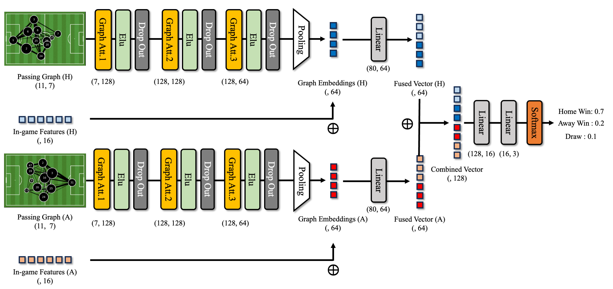

# We-Know-Who-Wins

This repository contains the Pytorch implementation code for the paper "We Know Who Wins: Graph-oriented Approaches of Passing Networks for Predictive Football Match Outcomes"

## Architectures



Both the passing graph and in-game features of each team are input to the model. The passing graph passes through three graph network blocks consisting of graph attention-dropout-elu layer to be pooled into graph embedding. The graph embeddings of both teams that have been fused with the in-game features are combined again to finally return the probability for each class.

## Dependencies

Please refer to [requirements.txt](requirements.txt) for package dependency to reproduce the code in this repository.

## Data

The data used in this study is from England's 1st division professional football league (Premier League) and 2nd division professional football league (Championship League) for the 20/21, 21/22, and 22/23 seasons, and consists of a total of 2835 games. All data was crawled from [Whoscored.com](https://1xbet.whoscored.com/), and the raw data is the HTML file of the web page for each match. The HTML files are shared through the zip file from our supplementary materials.

**When reproducing our code, please create a new folder named `Datasets` under `codes` folder to save the data.**

## Usage

You can run every steps from preprocessing the raw html data to testing new example through the following commands.

1. Preprocessing

This step takes raw html files as input and returns preprocessed `torch_geometric.Data`-type json file. The `pred_min` argument refers to the time period you want to make passing network to predict the outcome of the match. The default value will be set as 90 for `pred_min` argument unless provided.

```python
python3 preprocess.py --gpu_num [YOUR GPU NUM] --pred_min [Prediction Minute]
```

**However, we highly recommend you to skip the preprocessing part and directly go to the training part utlizing the uploaded preprocessed json files `final_home_90.json` and `final_away_90.json`, and the scaler `scaler.json` since this step might take more than an hour depending on the gpu capability**

2. Training

This step takes two json files (Home Data and Away Data) and trains the proposed model in our study. You can run this step through the following command.

```python
python3 training.py --gpu_num [YOUR GPU NUM]
```

The hyperparameters needed to train the model will be set as default as 1000 epochs with 10 patiences, 0.001 of learning rate and 90 minutesof prediction minute, unless you designate them by arguments. Plus, if you want to train the model for early-stage prediction like 45-minute or 70-minute, designate the value by providing additional argument --pred_min at the end of the command as below.

```python
python3 training.py --gpu_num [YOUR GPU NUM] --n_epochs 500 --e_patience 100 --lr 0.01 --pred_min 45
```

3. Testing

With the trained model, you can test the model performance. Here, there are two options you can take depending on whether you want to test the model using the testloaders made after preprocessing and trainig steps of this repository or to test the model with the whole new match data.

For the former, you can do it through the following command


```python
python3 testing.py --use_testloader yes --new_scaler no --gpu_num [YOUR GPU NUM]
```

For the latter, you can do it through the following command


```python
python3 testing.py --use_testloader no --new_scaler no --gpu_num [YOUR GPU NUM]
```


Here, the `--new_scaler` argument is [no] when you want to test a single match, or [yes] when you want to test more than one matches.
